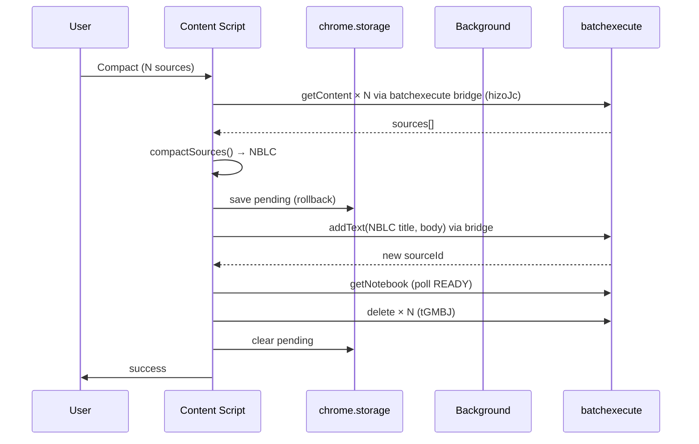
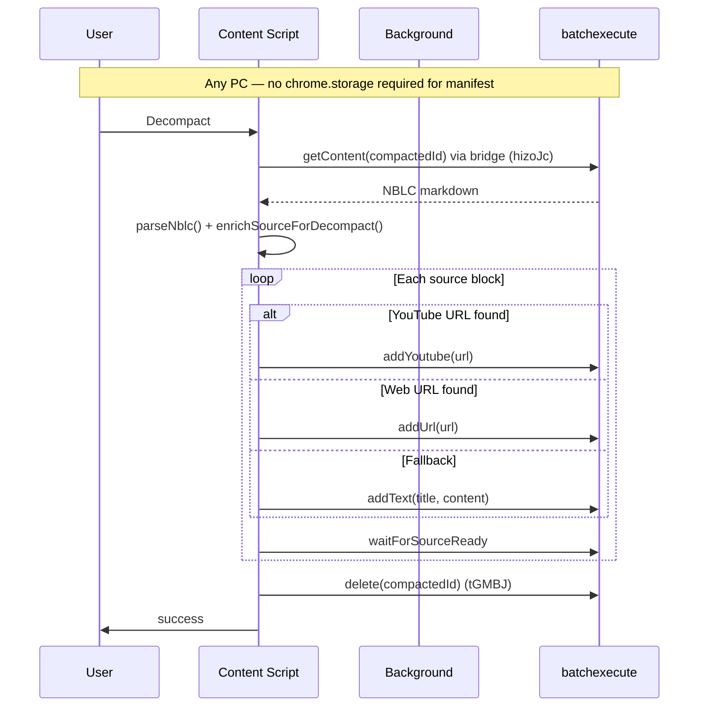

# Architecture

**Implementation status:** Phases 1–5 complete. Dual-browser support on `main` (manifest `1.0.0`, tag `v1.0.0`). See [AGENTS.md](../AGENTS.md).

## Browser compatibility

NotebookLM Compactor targets **Chrome/Chromium** and **Firefox ≥ 128** from a **single codebase** with **two release zips** (different `background` manifest fields).

| Aspect | Detail |
|--------|--------|
| **API namespace** | `chrome.storage`, `chrome.runtime` — WebExtensions-compatible; Firefox supports `chrome.*` without a polyfill |
| **Manifest** | Chrome: MV3 `background.service_worker`. Firefox: MV3 `background.scripts` (event page). Built by `scripts/build-extension.mjs` → `dist/chrome` / `dist/firefox`. Gecko block in base manifest. |
| **API transport** | `batchexecute` runs in the content script via `lib/runtime-messaging.js` + `content/batchexecute-bridge.js` (session cookies). Background worker handles storage sweep and message fallback. |
| **NBLC portability** | Cross-browser and cross-machine — restore metadata lives in uploaded markdown, not extension storage |
| **Firefox QA** | Passed — sign-off in [MANUAL_TEST_CHECKLIST.md](./MANUAL_TEST_CHECKLIST.md) (2026-06-20). Stable release `v1.0.0` tagged. |

User install paths: [FIREFOX.md](./FIREFOX.md) (Firefox), [README.md](../README.md#install) (Chrome).

## System context

```
┌─────────────────────────────────────────────────────────────┐
│  notebooklm.google.com (Angular SPA)                          │
│  ┌──────────────┐  ┌─────────────────────────────────────┐  │
│  │ Source panel │  │ Chat / Studio                       │  │
│  │ + checkboxes │  │                                     │  │
│  └──────┬───────┘  └─────────────────────────────────────┘  │
│         │ injected buttons (Compact / Decompact)            │
└─────────┼───────────────────────────────────────────────────┘
          │ content scripts
┌─────────▼───────────────────────────────────────────────────┐
│  NotebookLM-Compactor extension                             │
│  ┌─────────────┐  ┌──────────────┐  ┌──────────────────┐  │
│  │ lib/        │  │ content/     │  │ background/      │  │
│  │ DOM scrape  │  │ modals       │  │ source-api.js    │  │
│  │ NBLC format │  │ modals       │  │ storage sweep    │  │
│  │ runtime-    │  │ batchexecute │  │ (index.js)       │  │
│  │ messaging   │  │ bridge       │  └────────┬─────────┘  │
│  └─────────────┘  └──────┬───────┘           │ fallback  │
│                          │ batchexecute       │ sendMessage│
│                          │ (in-page fetch)    └───────────┘
└─────────────────────────────────────────────────────────────┘
          │
┌─────────▼───────────────────────────────────────────────────┐
│  Google NotebookLM batchexecute API                         │
│  hizoJc | izAoDd | tGMBJ | rLM1Ne                           │
└─────────────────────────────────────────────────────────────┘
```

## Component responsibilities

### `lib/notebooklm-api.js`

- `extractNotebookId()` from URL
- `extractATToken()` from page (CSRF for batchexecute)
- `extractBlVersion()` from page (`cfb2h` in `WIZ_global_data` or script tags)
- `extractSourcesFromDOM()` / `getSelectedSourceIds()`
- `extractUrlFromContent()` — fallback URL from `Source:` line in fetched markdown
- `isNblcSource(title)` — detect compacted sources for Decompact button

### `lib/source-panel-inject.js`

- MutationObserver on `document.body` (debounced, inject-once pattern)
- Inject **Compact** button (always enabled when sources selected)
- Inject **Decompact** button (enabled when exactly one NBLC-titled source is selected)
- Dispatch custom events: `nblc-compact`, `nblc-decompact`

### `lib/nblc-format.js`

- Pure functions: `compactSources()`, `parseNblc()`, `validateNblc()`, `isNblcTitle()`
- Decompact helpers: `resolveDecompactUpload()`, `enrichSourceForDecompact()`, `extractUrlFromContent()`, `describeDecompactMethod()`
- Parser tolerates NotebookLM round-trip: collapsed header lines, stripped `---` markers, fallback via `---END-META---` and `# [N] Title` headings
- No Chrome dependencies — unit test target

### `lib/manifest-store.js`

- `savePendingCompact()` / `savePendingDecompact()`
- `clearPending(notebookId)`
- `sweepStale(maxAgeMs)`
- Uses `chrome.storage.local`

### `lib/runtime-messaging.js` + `content/batchexecute-bridge.js`

- Modals call `runtimeMessaging.sendSourceApi(body)`
- Prefers in-page `NBLC.batchexecuteClient.handle()` (content-script `fetch` with cookies)
- Falls back to `chrome.runtime.sendMessage` → `background/index.js`

### `background/source-api.js`

Shared batchexecute implementation (used by content-script bridge and background fallback). All actions accept optional `blVersion` (from `extractBlVersion()`); falls back to `DEFAULT_BL_VERSION`.

| action | RPC | Status | Notes |
|--------|-----|--------|-------|
| `getContent` | hizoJc | ✅ | Returns `{ title, content, url?, sourceType? }`; URL from metadata slots `[7]` / `[5]` |
| `addText` | izAoDd | ✅ | Title + content; uses `buildTemplateBlock()` |
| `addUrl` | izAoDd | ✅ | Web URL at source-spec slot 2 |
| `addYoutube` | izAoDd | ✅ | YouTube URL at source-spec slot 7 |
| `getNotebook` | rLM1Ne | ✅ | Returns source status for polling |
| `waitForSourceReady` | rLM1Ne | ✅ | Polls until status READY (2) |
| `delete` | tGMBJ | ✅ | Single or batch |

### `background/rpc-parse.js`

Pure helpers for extracting source IDs and status from batchexecute responses. Unit tested via `test/rpc-parse.test.mjs`.

### `content/compact-modal.js`

**Flow:** select → confirm → fetch → merge → storage backup → upload → poll READY → delete originals → clear storage (optional zip on success)

**States:** `idle | fetching | merging | uploading | deleting | success | error`

### `content/decompact-modal.js`

**Flow:** fetch NBLC → parse preview (N sources, shows restore method + URL per row) → confirm → upload loop (`addYoutube` / `addUrl` / `addText` + `waitForSourceReady` per source) → delete compacted → clear storage

**States:** `fetching | preview | uploading | deleting | success | error`

## Sequence: Compact (full)



## Sequence: Decompact (cross-PC)



## Error handling

| Failure point | Behavior |
|---------------|----------|
| Fetch fails mid-compact | Abort; keep storage; no upload/delete |
| Upload fails | Abort delete; storage retained; user can retry |
| Delete fails after upload | Show warning; storage retained; user has both compacted + originals |
| Parse fails on decompact | Show error; no uploads |
| Partial decompact upload | Stop; storage has progress; user retry or manual cleanup |

## Security & privacy

- All API calls use user's existing Google session (`credentials: include`)
- Temporary storage holds full source text — cleared on success
- No external servers; no telemetry in spec

## Testing strategy

1. **Build:** `node scripts/build-extension.mjs` (required before load or release)
2. **Unit tests:** `test/nblc-format.test.js`, `test/rpc-parse.test.mjs`, `test/source-api.test.mjs`, `test/batchexecute-parse.test.mjs`
3. **Manual** on notebooklm.google.com with pasted-text, web, and YouTube sources
4. **Cross-PC** decompact: compact on account A machine, decompact on account B (same Google account)
5. **Regression** MutationObserver must not freeze page (see Source-Downloader incident)

## Relation to Source-Downloader

| Concern | Source-Downloader | Compactor |
|---------|-------------------|-----------|
| Fetch content | ✅ | reuse |
| Delete | ❌ | ✅ |
| Upload | ❌ | ✅ |
| UI button | Download | Compact / Decompact |
| Output | .md / .zip download | NBLC source in notebook |
| Storage | none | temporary rollback |

Copy files from `../NotebookLM-Source-Downloader/` when implementing; do not modify Downloader in place.