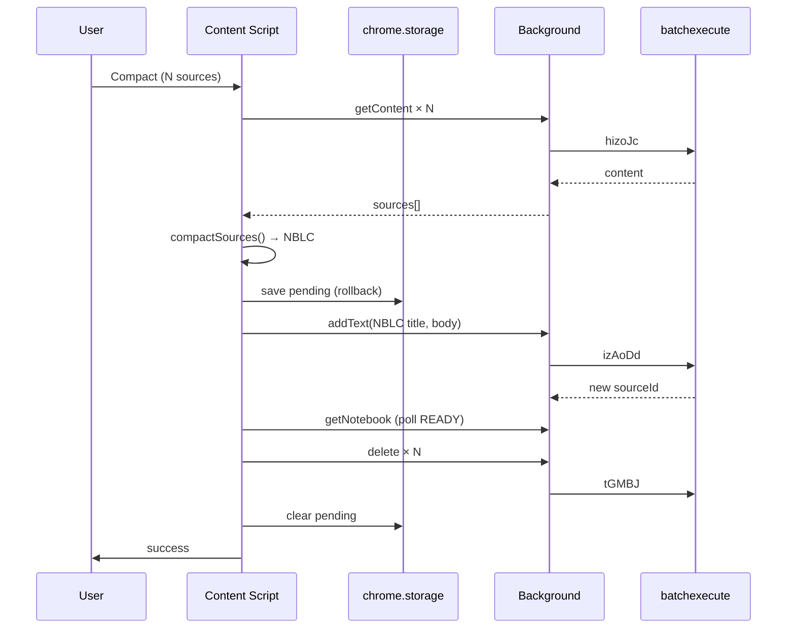
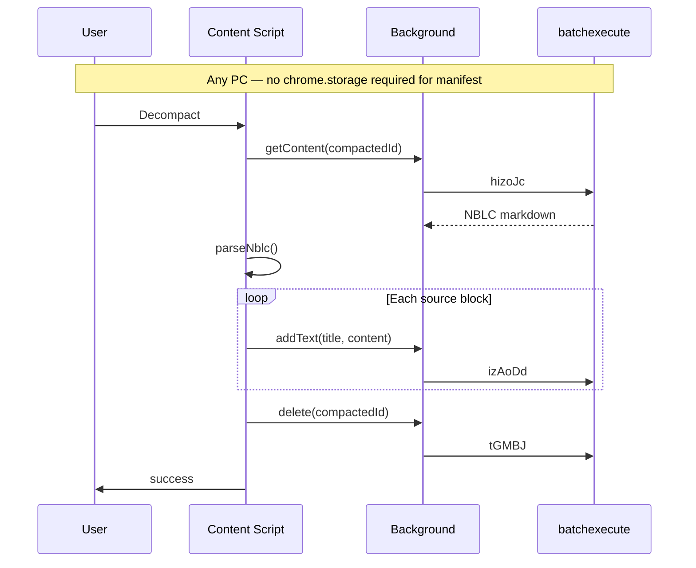

# Architecture

## System context

```
┌─────────────────────────────────────────────────────────────┐
│  notebooklm.google.com (Angular SPA)                          │
│  ┌──────────────┐  ┌─────────────────────────────────────┐  │
│  │ Source panel │  │ Chat / Studio                       │  │
│  │ + checkboxes │  │                                     │  │
│  └──────┬───────┘  └─────────────────────────────────────┘  │
│         │ injected buttons (Compact / Decompact)            │
└─────────┼───────────────────────────────────────────────────┘
          │ content scripts
┌─────────▼───────────────────────────────────────────────────┐
│  NotebookLM-Compactor extension                             │
│  ┌─────────────┐  ┌──────────────┐  ┌──────────────────┐  │
│  │ lib/        │  │ content/     │  │ background/      │  │
│  │ DOM scrape  │  │ modals       │  │ source-api.js    │  │
│  │ NBLC format │  │ events       │  │ batchexecute     │  │
│  │ storage     │  └──────┬───────┘  └────────┬─────────┘  │
│  └─────────────┘         │                    │            │
│                          └──── chrome.runtime.sendMessage ─┘
└─────────────────────────────────────────────────────────────┘
          │
┌─────────▼───────────────────────────────────────────────────┐
│  Google NotebookLM batchexecute API                         │
│  hizoJc | izAoDd | tGMBJ | rLM1Ne                           │
└─────────────────────────────────────────────────────────────┘
```

## Component responsibilities

### `lib/notebooklm-api.js`

- `extractNotebookId()` from URL
- `extractATToken()` from page
- `extractSourcesFromDOM()` / `getSelectedSourceIds()`
- `isNblcSource(title)` — detect compacted sources for Decompact button

### `lib/source-panel-inject.js`

- MutationObserver on `document.body` (debounced, inject-once pattern)
- Inject **Compact** button when sources selected
- Inject **Decompact** when viewing NBLC-titled source (or always in header with enable/disable)
- Dispatch custom events: `nblc-compact`, `nblc-decompact`

### `lib/nblc-format.js`

- Pure functions: `compactSources()`, `parseNblc()`, `validateNblc()`
- No Chrome dependencies — unit test target

### `lib/manifest-store.js`

- `savePendingCompact()` / `savePendingDecompact()`
- `clearPending(notebookId)`
- `sweepStale(maxAgeMs)`
- Uses `chrome.storage.local`

### `background/source-api.js`

| action | RPC | Notes |
|--------|-----|-------|
| `getContent` | hizoJc | exists in Source-Downloader |
| `delete` | tGMBJ | single or batch |
| `addText` | izAoDd | title + content |
| `getNotebook` | rLM1Ne | poll source status |

### `content/compact-modal.js`

UI flow: select → confirm → progress → done/error

States: `idle | fetching | merging | uploading | deleting | success | error`

### `content/decompact-modal.js`

UI flow: parse preview (N sources) → confirm → upload loop → delete compacted

## Sequence: Compact (full)



## Sequence: Decompact (cross-PC)



## Error handling

| Failure point | Behavior |
|---------------|----------|
| Fetch fails mid-compact | Abort; keep storage; no upload/delete |
| Upload fails | Abort delete; storage retained; user can retry |
| Delete fails after upload | Show warning; storage retained; user has both compacted + originals |
| Parse fails on decompact | Show error; no uploads |
| Partial decompact upload | Stop; storage has progress; user retry or manual cleanup |

## Security & privacy

- All API calls use user's existing Google session (`credentials: include`)
- Temporary storage holds full source text — cleared on success
- No external servers; no telemetry in spec

## Testing strategy

1. **Unit tests** for `nblc-format.js` (merge/roundtrip parse)
2. **Manual** on notebooklm.google.com with 2–3 small pasted-text sources
3. **Cross-PC** decompact: compact on account A machine, decompact on account B (same Google account)
4. **Regression** MutationObserver must not freeze page (see Source-Downloader incident)

## Relation to Source-Downloader

| Concern | Source-Downloader | Compactor |
|---------|-------------------|-----------|
| Fetch content | ✅ | reuse |
| Delete | ❌ | ✅ |
| Upload | ❌ | ✅ |
| UI button | Download | Compact / Decompact |
| Output | .md / .zip download | NBLC source in notebook |
| Storage | none | temporary rollback |

Copy files from `../NotebookLM-Source-Downloader/` when implementing; do not modify Downloader in place.