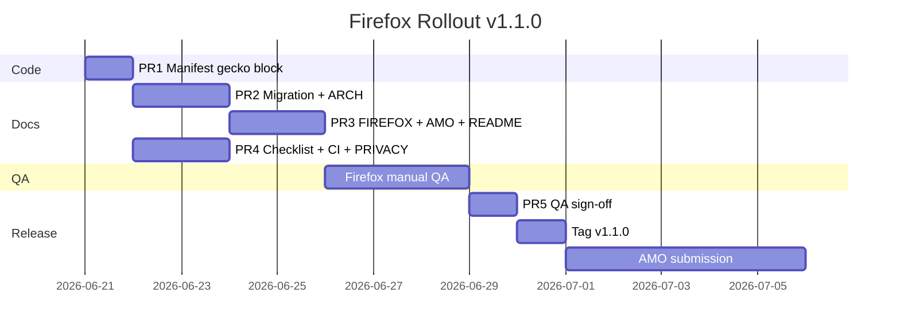

# Firefox migration plan

Maintainer guide for dual-browser support (Chrome + Firefox). End-user install steps live in [FIREFOX.md](./FIREFOX.md).

**Design reference:** Firefox migration design approved 2026-06-20. Target release: **`v1.1.0`**.

## Compatibility conclusion

The extension is **already cross-browser at the API level**. No Chrome-only APIs are used (`chrome.scripting`, `chrome.downloads`, `declarativeNetRequest`, `sidePanel`, etc.).

| API / pattern | Files | Firefox |
|---------------|-------|---------|
| `chrome.storage.local` | `lib/manifest-store.js`, `lib/user-consent.js`, `background/storage-sweep.js`, `content/recovery-banner.js` | ✅ |
| `chrome.runtime` messaging | `background/index.js`, `content/compact-modal.js`, `content/decompact-modal.js` | ✅ |
| MV3 background (event page) | `background/background.bundle.js` via `background.scripts` | ✅ (Firefox 128+; not `service_worker`) |
| `fetch` + `credentials: "include"` | `background/source-api.js` | ✅ (verify in QA) |
| Content-script Blob downloads | `content/compact-modal.js` | ✅ |
| DOM scraping | `lib/notebooklm-api.js`, `lib/source-panel-inject.js` | ⚠️ untested — QA required |

**Decision:** Keep `chrome.*` namespace. Firefox supports it natively; no `webextension-polyfill`.

## Manifest checklist (PR 1)

Add to `manifest.json` (version stays **`1.0.0`** until release runbook):

```json
"browser_specific_settings": {
  "gecko": {
    "id": "notebooklm-compactor@ayv4zyan.github",
    "strict_min_version": "128.0",
    "data_collection_permissions": {
      "required": ["none"]
    }
  }
}
```

| Field | Notes |
|-------|-------|
| `gecko.id` | **Immutable after first AMO upload.** Locked to `notebooklm-compactor@ayv4zyan.github`. |
| `strict_min_version` | `128.0` — first ESR baseline after MV3 stabilization. Module SW works since 114+, but 114–127 are excluded to reduce support burden. |
| `data_collection_permissions` | Required AMO policy declaration; extension collects no telemetry. |

Verify load: `about:debugging` → Load Temporary Add-on → no SW startup errors.

## Code paths to smoke-test

| File | Firefox concern |
|------|-----------------|
| `background/source-api.js` | Session cookies on extension `fetch`; `waitForSourceReady` holds SW up to 120s |
| `content/decompact-modal.js` | One `waitForSourceReady` per restored source (multiplies SW exposure) |
| `lib/notebooklm-api.js` | AT token / `cfb2h` extraction from page |
| `lib/source-panel-inject.js` | Button injection; MutationObserver freeze regression |
| `content/recovery-banner.js` | `chrome.storage.onChanged` listener |
| `content/compact-modal.js` | `escapeHtml()` on user titles in modal templates |

## QA gate

Firefox manual QA uses [MANUAL_TEST_CHECKLIST.md](./MANUAL_TEST_CHECKLIST.md) (Firefox section).

| Gate | Rule |
|------|------|
| **Start QA** | After **PR 4** merges (checklist exists) |
| **Sign-off (PR 5)** | Requires **PRs 1–4 and PR 3** merged |
| **Release runbook** | Requires PR 5 sign-off + user docs (PR 3) |

**Must pass the Firefox section before tagging `v1.1.0`.**

## AMO submission steps

AMO review is **not** a gate for the GitHub tag. Tag first; submit after.

1. Create or log in to the [Firefox Add-on Developer Hub](https://addons.mozilla.org/developers/).
2. Create a new extension listing (or new version on existing listing).
3. Upload `notebooklm-compactor-firefox.zip` from the `v1.1.0` GitHub Release — not the git working tree.
4. Upload the **source code archive** (see [AMO source-code submission](#4-amo-source-code-submission) below).
5. Paste listing copy from [AMO_LISTING.md](./AMO_LISTING.md) (PR 3).
6. Set privacy policy URL to `PRIVACY.md` on GitHub (same as Chrome Web Store).
7. Submit for review; respond to reviewer questions (allow days–weeks).
8. After approval: update [FIREFOX.md](./FIREFOX.md) with the live AMO URL (follow-up commit/PR).

**Signing:** AMO signs the uploaded zip on approval. No separate `web-ext sign` step is required unless you choose a self-hosted distribution channel.

## Release runbook (maintainer actions — not a PR)

**Precondition:** PRs 1–4 and PR 3 merged; PR 5 QA sign-off recorded.

### 1. Version bump and tag

```bash
# On main, after PR 5 merged:
# Edit manifest.json: "version": "1.0.0" → "1.1.0"
git add manifest.json
git commit -m "chore(release): bump version to 1.1.0"
git tag v1.1.0
git push origin main
git push origin v1.1.0
```

This triggers `.github/workflows/release.yml` → `notebooklm-compactor-chrome.zip` and `notebooklm-compactor-firefox.zip` on GitHub Releases.

### 2. Verify GitHub Release zip

1. Download `notebooklm-compactor-firefox.zip` from the `v1.1.0` GitHub Release.
2. Confirm `manifest.json` inside the zip includes `browser_specific_settings.gecko`, `"version": "1.1.0"`, and `background.scripts` (not `service_worker`).
3. Load in a **clean Firefox profile** via `about:debugging` → Load Temporary Add-on.
4. Run a minimal Compact + Decompact on a throwaway notebook.

### 3. Submit to AMO

Follow [AMO submission steps](#amo-submission-steps) above.

### 4. AMO source-code submission

Required because `vendor/jszip.min.js` is minified third-party code listed in `manifest.json` `content_scripts` and used for optional backup zip downloads in `content/compact-modal.js`.

| Deliverable | Detail |
|-------------|--------|
| **Archive** | Full public repo zip at tag `v1.1.0` (or paths matching `release.yml` plus `test/`, `docs/`) |
| **Build instructions** | No compile step. Reproduce release zip: |

```bash
zip -r notebooklm-compactor.zip \
  manifest.json LICENSE TERMS.md PRIVACY.md SECURITY.md \
  background content lib vendor icons \
  -x "icons/*.plasmo.*.png"
```

| **Third-party library** | [Stuk/jszip](https://github.com/Stuk/jszip) — `vendor/jszip.min.js` v3.10.1; client-side backup zip only |
| **Reviewer statement** | No remote code; no author-minified code; only vendored JSZip |

### 5. Post-approval URL update

Update [FIREFOX.md](./FIREFOX.md) with the live AMO listing URL (follow-up commit/PR).

### 6. Chrome Web Store (optional)

Upload `notebooklm-compactor-chrome.zip` to Chrome Web Store for version parity (`v1.1.0`).

## Rollout sequence



## Escalation triggers

If Firefox QA reproduces any of the following, **do not tag `v1.1.0`** — implement conditional **PR 6** first:

| Symptom | Likely cause | Fix direction |
|---------|--------------|---------------|
| "Extension context invalidated" during decompact | MV3 SW terminated during `waitForSourceReady` (120s poll) | Split poll into short SW messages; content script drives polling |
| Compact fetch fails with valid session | Cookies not attached on extension `fetch` | Investigate `host_permissions`; consider content-script fetch (larger change) |
| Buttons never inject | DOM / selector mismatch in Firefox | Update `lib/source-panel-inject.js` selectors |

Re-run full Firefox checklist after PR 6 before PR 5 sign-off.

## Rollback

| Scope | Action |
|-------|--------|
| Pre-release | Revert gecko block PR; Chrome users unaffected |
| Post-AMO | Unlist AMO listing; users fall back to temporary load |
| Post-tag | Yank GitHub Release; revert version bump on `main` |

## PR plan summary

| PR | Title | Key files |
|----|-------|-----------|
| 1 | `feat(manifest): add Firefox gecko settings` | `manifest.json` (gecko block; version stays `1.0.0`) |
| 2 | `docs: Firefox migration + architecture` | This file, `ARCHITECTURE.md`, `AGENTS.md`, `CONTEXT.md` |
| 3 | `docs: Firefox user guide + AMO listing` | `FIREFOX.md`, `AMO_LISTING.md`, `README.md` |
| 4 | `docs(ci): Firefox checklist + PRIVACY + lint` | `MANUAL_TEST_CHECKLIST.md`, `PRIVACY.md`, `ci.yml` |
| 5 | `docs: Firefox QA sign-off` | Checklist sign-off table only |
| 6 | *(conditional)* `fix(background): SW resilience` | `source-api.js`, modals |

## References

- [ARCHITECTURE.md](./ARCHITECTURE.md) — component map
- [AMO_LISTING.md](./AMO_LISTING.md) — store copy (PR 3)
- [Mozilla MV3 migration](https://extensionworkshop.com/documentation/develop/manifest-v3-migration/)
- [Mozilla publishing](https://extensionworkshop.com/documentation/publish/)
- [browser_specific_settings](https://developer.mozilla.org/en-US/docs/Mozilla/Add-ons/WebExtensions/manifest.json/browser_specific_settings)